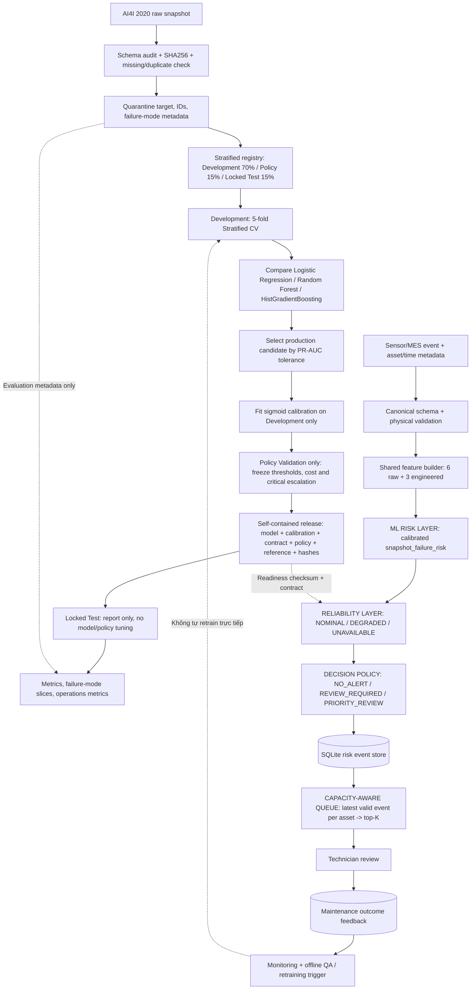

# AI4I Condition-Based Maintenance Risk Triage

[](https://www.python.org/)

Hệ thống này nhận một operating snapshot của máy, tính rủi ro hỏng hóc đã hiệu chuẩn, kiểm tra độ tin cậy của dữ liệu cảm biến và đưa ra quyết định triage theo năng lực xử lý của đội bảo trì.

> **Scope:** condition-based snapshot risk triage. This project does not estimate RUL, time-to-failure or future failure probability.

## Kết quả đã khóa

Các số liệu dưới đây được đọc từ release Random Forest mới nhất và `reports/final_test_metrics.json`. Locked Test chỉ dùng để báo cáo sau khi model, calibration và policy đã được đóng băng.

### Locked Test

| Metric | Result |
|---|---:|
| PR-AUC | 0.9302 |
| ROC-AUC | 0.9794 |
| Brier | 0.0055 |
| ECE | 0.0080 |
| Precision | 0.807 |
| Recall | 0.902 |

### Critical slices

| Failure Mode | Recall | Detected / Total |
|---|---:|---:|
| TWF | 20% | 1 / 5 |
| HDF | 100% | 21 / 21 |
| PWF | 100% | 11 / 11 |
| OSF | 100% | 15 / 15 |
| RNF | 0% | 0 / 1 |

Các slice này được đặt ngay cạnh headline metric để không cherry-pick kết quả tổng thể. TWF là giới hạn quan trọng của sensor contract hiện tại; RNF không có precursor đáng tin trong dữ liệu snapshot.

### Operations metrics

| Metric | Locked Test | Cách đọc |
|---|---:|---|
| Failure Capture@1% | 29.41% | Tỷ lệ failure nằm trong 1% snapshot có risk cao nhất |
| Failure Capture@2% | 58.82% | Tỷ lệ failure nằm trong 2% snapshot có risk cao nhất |
| Failure Capture@3% | 84.31% | Tỷ lệ failure nằm trong 3% snapshot có risk cao nhất |
| Queue Precision@1% | 100.00% | Tỷ lệ failure trong queue top 1% |
| Queue Precision@2% | 100.00% | Tỷ lệ failure trong queue top 2% |
| Queue Precision@3% | 95.56% | Tỷ lệ failure trong queue top 3% |
| Review Coverage | 3.80% | Tỷ lệ snapshot vượt ngưỡng review chính |
| Priority Override Rate | 85.96% | Tỷ lệ event review đạt ngưỡng priority trong nhóm review |

Các metric trên được tính bằng `src/policy.py` và ghi vào `test_performance` bởi `src/evaluate.py`. Đây là benchmark trên Locked Test, không phải cam kết công suất cho một nhà máy khác.

## Bài toán & phạm vi ứng dụng

### Bài toán

AI4I 2020 cung cấp các snapshot vận hành gồm nhiệt độ, tốc độ quay, mô-men xoắn, thời gian mòn dụng cụ và loại chất lượng sản phẩm. Mục tiêu là phân loại `machine_failure` tại chính snapshot đó, sau đó chuyển xác suất đã hiệu chuẩn thành hành động vận hành:

- `NO_ALERT`: không đưa vào queue.
- `REVIEW_REQUIRED`: cần kỹ thuật viên kiểm tra.
- `PRIORITY_REVIEW`: ưu tiên cao và được giữ lại như priority override.

Điểm `snapshot_failure_risk` chỉ mô tả rủi ro của trạng thái hiện tại dưới phân bố AI4I. Nó không phải RUL, time-to-failure, forecast theo thời gian hay xác suất máy sẽ hỏng trong một horizon tương lai.

### Dataset Card

| Thuộc tính | Giá trị |
|---|---|
| Dataset | AI4I 2020 Predictive Maintenance Dataset |
| Problem | `machine_failure` classification |
| Observation unit | Một operating snapshot |
| Quy mô | 10.000 dòng, 339 failure (3,39%) |
| Temporal ordering | Unavailable |
| Split | Stratified random: Development 70%, Policy Validation 15%, Locked Test 15% |
| Leakage boundary | Loại `UDI`, `Product ID`; cách ly TWF/HDF/PWF/OSF/RNF khỏi feature |
| Generalization claim | i.i.d. snapshot generalization trong phân bố benchmark AI4I |

Do dataset không có event-time trajectory đáng tin cậy, repo không đưa ra temporal validation hay claim cho future unseen machines.

## Luồng logic, luồng dữ liệu và quy trình kỹ thuật duy nhất

Sơ đồ dưới đây là contract cấp hệ thống. Offline training, online API, release artifact, monitoring và báo cáo đều phải tuân theo cùng một thứ tự; không có nhánh nào được dùng target-derived metadata để suy luận.



### Luồng dữ liệu offline

1. `src.data.load_raw_dataset()` đọc `data/raw/ai4i2020.csv`.
2. `audit_dataset()` canonicalize header, kiểm tra missing/duplicate, prevalence và SHA256.
3. `create_or_load_split_registry()` giữ index stratified cố định. Manifest cũ sai contract sẽ được tạo lại.
4. `build_canonical_features()` tạo đúng 9 model features; target, ID và failure mode không lọt vào vector.
5. Development dùng 5-fold CV để so sánh ba base model.
6. Model được chọn trước khi calibration. Calibration là stage riêng, rồi mới dùng Policy Validation để đóng băng policy.
7. Locked Test chỉ được mở ở bước đánh giá cuối; ngưỡng không được tìm kiếm trên test.
8. `src.evaluate` ghi báo cáo và cập nhật `locked_test_metrics.json` trong release hiện hành.

### Luồng dữ liệu online

1. `/score` nhận sensor snapshot cùng metadata runtime.
2. API chuẩn hóa `product_quality_type` về `quality_type`; alias cũ vẫn được nhận để tương thích. `event_time` phải có timezone và được chuẩn hóa về UTC.
3. Inference gọi cùng feature builder với training, chạy model/calibration trong release mới nhất.
4. Reliability gate so với `reference_distribution.json`:
   - `NOMINAL`: nằm trong guardrail tham chiếu.
   - `DEGRADED`: có feature ngoài guardrail; vẫn chấm điểm nhưng phải lưu warning.
   - `UNAVAILABLE`: thiếu reference hoặc bundle không sẵn sàng; fail-closed, buộc review và không cho `NO_ALERT`.
5. Policy ánh xạ risk thành action. Risk event và prediction được lưu vào SQLite.
6. Queue lấy event hợp lệ mới nhất của từng `asset_id`, giữ toàn bộ `PRIORITY_REVIEW`, rồi lấy top-K event `REVIEW_REQUIRED` theo risk giảm dần.
7. Review của kỹ thuật viên chỉ là outcome feedback cho QA/retraining offline, không cập nhật model ngay trong request.

## Feature contract

README chỉ giữ tóm tắt để dễ đọc. Hợp đồng đầy đủ, công thức và leakage boundary nằm tại [docs/FEATURE_CONTRACT.md](docs/FEATURE_CONTRACT.md).

Model nhận **6 raw operating variables + 3 domain-informed engineered features**:

- Raw: `quality_type`, `air_temperature_k`, `process_temperature_k`, `rotational_speed_rpm`, `torque_nm`, `tool_wear_min`.
- Engineered: `temperature_delta_k`, `mechanical_power_w`, `wear_load_interaction`.

Thứ tự feature là một phần của contract và được kiểm tra khi readiness. Runtime metadata (`event_id`, `asset_id`, `event_time`, `line_id`, `sensor_source`, `shift`) chỉ dùng cho traceability, monitoring và queue.

## Model, calibration và policy

- **Base model:** Logistic Regression là baseline; Random Forest và HistGradientBoosting là các ứng viên production/challenger.
- **Selection:** 5-fold Stratified CV trên Development, ưu tiên PR-AUC; Random Forest được chọn khi nằm trong tolerance 0,01 so với ứng viên tốt nhất.
- **Calibration:** sigmoid cross-fitted calibration, fit trong Development.
- **Policy:** cost-sensitive với `FN=5`, `FP=1`; ngưỡng chính và ngưỡng priority chỉ được tìm trên Policy Validation.
- **Capacity:** policy lưu các kịch bản 5%, 3% và 2%; queue runtime vẫn áp dụng `capacity` thực tế từ request.
- **Monitoring:** PSI/guardrail chỉ tạo tín hiệu điều tra; không tự động retrain vì drift có thể đến từ regime, vật liệu, cảm biến hoặc maintenance event.

`releases/<model_version>/` là nguồn artifact runtime chuẩn. `artifacts/champion/` và `models/` chỉ là mirror chuyển tiếp cho client cũ.

## API và dữ liệu runtime

### Endpoint

| Method | Path | Mục đích |
|---|---|---|
| GET | `/health/live` | Liveness probe |
| GET | `/health/ready` | Kiểm tra release, hash, contract, reference và sample inference |
| GET | `/health` | Trạng thái tổng quát, tương thích ngược |
| POST | `/score` | Endpoint canonical chấm điểm snapshot |
| POST | `/predict-risk` | Alias tương thích cho `/score` |
| POST | `/maintenance/queue/build` | Dựng queue theo capacity và shift |
| POST | `/maintenance/reviews` | Ghi feedback kỹ thuật viên |

### Request mẫu

```json
{
  "event_id": "evt_123",
  "asset_id": "MACHINE_042",
  "event_time": "2026-09-07T10:15:00Z",
  "shift": "2026-09-07-NIGHT",
  "product_quality_type": "M",
  "air_temperature_k": 300.2,
  "process_temperature_k": 310.1,
  "rotational_speed_rpm": 1510,
  "torque_nm": 42.1,
  "tool_wear_min": 178
}
```

Response canonical có `risk.snapshot_failure_risk`, `reliability.status`, `triage.action`, `queue_eligible` và `observed_conditions`. Các block legacy như `prediction`, `decision` và `operational_context` vẫn được giữ để client cũ migrate dần.

SQLite runtime mặc định là `data/runtime/risk_events.sqlite3`; có thể đổi bằng biến môi trường `RISK_EVENT_DB_PATH`. Thư mục runtime và database không phải source artifact, đã được loại khỏi Git. Readiness probe và dashboard không ghi event giả vào store.

## Release và báo cáo

Mỗi release tự chứa:

```text
model.joblib
model_config.json
feature_contract.json
calibration.json
decision_policy.json
reference_distribution.json
data_manifest.json
validation_metrics.json
locked_test_metrics.json
MODEL_CARD.md
manifest.json
```

`manifest.json` chứa SHA256 của model, contract, policy, reference và các file thành phần. Readiness fail-closed khi bundle thiếu file, hash sai, contract sai thứ tự hoặc không có reference distribution.

Báo cáo quan trọng:

- `reports/data_audit.json`: chất lượng dữ liệu và leakage boundary.
- `reports/split_manifest.json`: index và tỷ lệ split cố định.
- `reports/validation_metrics.json`: CV leaderboard và policy validation.
- `reports/final_test_metrics.json`: Locked Test, slice và operations metrics.
- `reports/failure_mode_analysis.json`: recall theo TWF/HDF/PWF/OSF/RNF.
- `reports/twf_error_analysis.json`: phân tích snapshot TWF detected/missed.

## Cấu trúc thư mục dự án

```text
Predictive-Maintenance-Ai4i/
├── app.py                         # Streamlit dashboard
├── configs/
│   ├── model.yaml                 # Cấu hình tham chiếu model/split
│   └── decision_policy.yaml       # Cấu hình tham chiếu policy/reliability
├── data/
│   ├── raw/ai4i2020.csv           # Dataset; tải bằng scripts nếu chưa có
│   └── runtime/                    # SQLite runtime, không commit
├── docs/
│   └── FEATURE_CONTRACT.md        # Hợp đồng 9 features và leakage boundary
├── releases/<model_version>/      # Bundle self-contained có checksum
├── artifacts/champion/            # Mirror legacy JSON
├── models/                        # Mirror legacy model/config
├── reports/                       # Audit, validation, test và slice reports
├── scripts/
│   └── download_data.py           # Tải AI4I 2020 từ UCI
├── src/
│   ├── api.py                     # FastAPI endpoints
│   ├── artifact.py                # Tìm và verify release bundle
│   ├── contracts.py               # Schema canonical và leakage boundary
│   ├── data.py                    # Audit, split registry, dataset loader
│   ├── evaluate.py                # Locked Test report-only evaluation
│   ├── features.py                # Feature builder dùng chung train/inference
│   ├── inference.py               # Risk, reliability, triage và event
│   ├── models.py                  # Pipeline, candidate models và metrics
│   ├── monitoring.py              # Guardrail, PSI và workload monitoring
│   ├── policy.py                  # Threshold, queue và operations metrics
│   ├── storage.py                 # SQLite event/review store
│   ├── train.py                   # CV -> calibration -> policy -> release
│   └── utils.py                   # Logging, seed và JSON utilities
├── tests/                         # Smoke, contract và integration tests
├── requirements.txt
├── Dockerfile
├── Makefile
└── README.md
```

## Hướng dẫn cài đặt và chạy thử nghiệm

### 1. Tạo môi trường và cài dependency

Windows PowerShell:

```powershell
python -m venv .venv
.\.venv\Scripts\Activate.ps1
python -m pip install --upgrade pip
python -m pip install -r requirements.txt
```

Linux/macOS:

```bash
python3 -m venv .venv
source .venv/bin/activate
python -m pip install --upgrade pip
python -m pip install -r requirements.txt
```

Yêu cầu Python 3.10 trở lên. Nếu `data/raw/ai4i2020.csv` chưa tồn tại, tải dữ liệu:

```bash
python scripts/download_data.py
```

### 2. Chạy pipeline chuẩn

```bash
python -m src.train
python -m src.evaluate
```

Pipeline sinh release mới, cập nhật mirror legacy và ghi báo cáo validation/test. Không chạy `evaluate` trước `train` nếu chưa có release hợp lệ.

### 3. Chạy API và dashboard

```bash
uvicorn src.api:app --reload
streamlit run app.py
```

API mặc định ở `http://127.0.0.1:8000`; tài liệu OpenAPI ở `/docs`. Dashboard mặc định ở `http://localhost:8501`.

### 4. Kiểm tra code và logic

```bash
pytest -q
python -m ruff check --no-cache src app.py tests scripts
```

Các test chính kiểm tra leakage boundary, alias schema, unavailable reliability, release hash, queue latest-per-asset, priority override và rejection của target/identifier trong direct inference.

### 5. Chạy bằng Makefile

```bash
make setup
make download
make train
make evaluate
make test
make serve
make dashboard
```

## Giới hạn và cách diễn giải

> **Scope:** đây là hệ thống triage rủi ro theo operating snapshot hiện tại. Không dùng kết quả để suy ra RUL, thời điểm hỏng, xác suất hỏng trong tương lai hoặc hiệu năng temporal ngoài AI4I.

- Split là stratified random vì AI4I không có temporal ordering hợp lệ.
- TWF và RNF là critical slices cần được giám sát riêng; overall PR-AUC không thay thế slice review.
- `DEGRADED` là guardrail cảnh báo phân bố, không phải xác suất OOD hay uncertainty của model.
- Failure-mode flags là metadata hậu nghiệm, chỉ dùng cho phân tích test; không được dùng làm input suy luận.
- Review feedback hiện được lưu cho QA/offline retraining; không tự động thay đổi model trong production.

## License

Xem [LICENSE](LICENSE).
