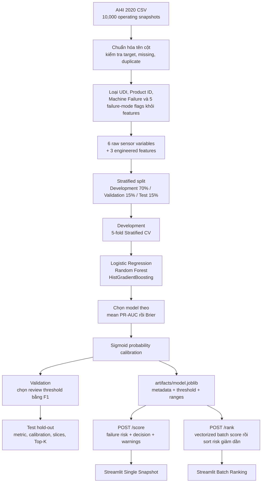

# AI4I Maintenance Risk Triage

[](https://github.com/haminhthong/AI4I-Maintenance-Risk-Triage/actions/workflows/ci.yml)
[](https://www.python.org/)
[](https://scikit-learn.org/)
[](https://fastapi.tiangolo.com/)
[](https://streamlit.io/)
[](https://docs.astral.sh/ruff/)
[](LICENSE)

AI4I 2020 được dùng cho bài toán **imbalanced failure-risk classification ở cấp operating snapshot**. Mỗi dòng dữ liệu là trạng thái vận hành hiện tại của một máy; model trả về xác suất failure của chính snapshot đó để hỗ trợ review và xếp hạng Top-K.

> **Scope:** Đây không phải RUL, time-to-failure, time-series forecasting hay xác suất máy sẽ hỏng trong một horizon tương lai. Dataset không cung cấp temporal ordering đáng tin cho các claim đó.

## Kết quả trên Test hold-out

Model được chọn bằng 5-fold Stratified CV trên Development, calibration bằng sigmoid sau khi chọn model, threshold được chọn bằng F1 trên Validation. Test chỉ dùng một lần để báo cáo.

### Locked Test

| Metric | Result |
| --- | ---: |
| PR-AUC | 0.9254 |
| ROC-AUC | 0.9864 |
| Brier | 0.0051 |
| ECE | 0.0062 |
| Precision | 0.9778 |
| Recall | 0.8627 |
| Review coverage | 3.00% |

### Critical slices

| Failure mode | Test cases | Recall |
| --- | ---: | ---: |
| TWF | 5 | 20.00% |
| HDF | 21 | 95.24% |
| PWF | 11 | 100.00% |
| OSF | 15 | 93.33% |
| RNF | 1 | 0.00% |

TWF là điểm yếu rõ ràng. RNF chỉ có một test case nên không được diễn giải như một ước lượng ổn định theo class.

### Ranking metrics

| Top-K snapshot | Failure Capture@K | Queue Precision@K |
| ---: | ---: | ---: |
| 1% | 29.41% | 100.00% |
| 2% | 58.82% | 100.00% |
| 3% | 86.27% | 97.78% |

Đây là ranking analysis: nếu chỉ kiểm tra nhóm snapshot có risk cao nhất, nhóm đó bắt được bao nhiêu failure. Repo không giả lập capacity, asset queue hay technician workflow.

## Bài toán & phạm vi ứng dụng

AI4I có 10.000 operating snapshots và tỷ lệ failure 3,39% (`339/10.000`). Accuracy không phải metric chính; PR-AUC được ưu tiên vì phản ánh tốt hơn positive class hiếm.

Mục tiêu kỹ thuật:

- loại identifier, target và failure-mode flags khỏi feature matrix;
- giữ failure-mode flags riêng để đánh giá lỗi sau khi model đã score;
- dùng cùng feature builder cho train và serving;
- so sánh Logistic Regression, Random Forest và HistGradientBoosting;
- calibration probability vì output được dùng làm risk score và ranking;
- chọn threshold trên Validation, không tối ưu trên Test;
- score một snapshot hoặc xếp hạng một batch snapshot.

## Luồng logic và luồng dữ liệu

Đây là pipeline duy nhất chi phối train, evaluation, API và dashboard:



### Feature contract

**6 raw operating variables:**

`quality_type`, `air_temperature_k`, `process_temperature_k`, `rotational_speed_rpm`, `torque_nm`, `tool_wear_min`.

**3 domain-informed engineered features:**

| Feature | Công thức | Ý nghĩa |
| --- | --- | --- |
| `temperature_delta_k` | `process_temperature_k - air_temperature_k` | Chênh lệch nhiệt độ vận hành |
| `mechanical_power_w` | `torque_nm × rpm × 2π / 60` | Proxy công suất cơ học |
| `wear_load_interaction` | `tool_wear_min × torque_nm` | Tương tác giữa mòn dụng cụ và tải |

Engineered features luôn được tính lại từ raw sensors. Client không thể gửi một giá trị derived khác với công thức train.

Các feature này dựa trên quan hệ vật lý từ raw sensor và phù hợp với cấu trúc synthetic của AI4I. Vì vậy mức cải thiện trên benchmark không nên được diễn giải là bằng chứng mô hình sẽ đạt mức tương tự trên dữ liệu nhà máy thực.

### Feature ablation

| Feature set | PR-AUC CV mean ± std | Brier CV mean ± std |
| --- | ---: | ---: |
| Raw 6 | 0.7342 ± 0.0760 | 0.0171 ± 0.0015 |
| Raw 6 + engineered 3 | 0.8845 ± 0.0419 | 0.0094 ± 0.0015 |

Kết quả này là lý do giữ 3 engineered features, thay vì thêm nhiều biến biến đổi không có căn cứ domain.

## Dataset card

| Field | Value |
| --- | --- |
| Dataset | AI4I 2020 Predictive Maintenance Dataset |
| Problem | `machine_failure` classification |
| Observation unit | Operating snapshot |
| Rows | 10,000 |
| Failure prevalence | 3.39% |
| Temporal ordering | Unavailable |
| Split | Stratified random: 70% / 15% / 15%, gắn với SHA256 dataset |
| Claim | i.i.d. snapshot generalization trong benchmark distribution |

`TWF`, `HDF`, `PWF`, `OSF`, `RNF` có quan hệ hậu nghiệm với target nên chỉ được dùng để phân tích failure-mode trên Test, không đi vào model.

## Cấu trúc thư mục

```text
AI4I-Maintenance-Risk-Triage/
├── app.py                         # Streamlit: single snapshot + batch ranking
├── artifacts/
│   ├── model.joblib               # Model pipeline đã calibration
│   ├── metadata.json              # Model, feature, dataset và môi trường
│   ├── threshold.json             # Review threshold từ Validation
│   └── reference_ranges.json      # Range tham chiếu để cảnh báo input
├── data/raw/ai4i2020.csv          # Dataset AI4I được dùng trong CI
├── reports/
│   ├── data_audit.json             # Data validation và leakage boundary
│   ├── split_manifest.json          # Chỉ số split + SHA256 dataset
│   ├── validation_metrics.json     # CV leaderboard, ablation, threshold
│   ├── feature_ablation.json       # Raw 6 so với raw + engineered 3
│   ├── final_test_metrics.json     # Test metrics, calibration, Top-K
│   ├── failure_mode_analysis.json  # Recall TWF/HDF/PWF/OSF/RNF
│   └── twf_error_analysis.json      # Tóm tắt TWF detected/missed
├── src/
│   ├── contracts.py                # Tên cột và feature constants
│   ├── data.py                     # Load, audit, split
│   ├── features.py                 # Shared train/serve feature builder
│   ├── models.py                   # Preprocessor, candidates, metrics
│   ├── policy.py                   # F1 threshold và Top-K ranking
│   ├── input_validation.py         # Range warnings, không phải OOD detector
│   ├── train.py                    # CV -> calibration -> artifacts
│   ├── evaluate.py                 # Test hold-out và failure slices
│   ├── inference.py                # /score và /rank dùng chung
│   └── api.py                      # FastAPI endpoints
├── tests/                          # Unit, data-contract và API smoke tests
├── scripts/download_data.py        # Tải dataset từ UCI khi cần
├── Dockerfile                      # Image API phục vụ artifact đã train
├── Makefile
├── requirements.txt
├── requirements-api.txt             # Dependency tối thiểu cho API image
├── requirements-ci.txt              # Dependency tối thiểu, cố định cho pytest trên CI
└── .github/workflows/ci.yml
```

`artifacts/` là source of truth duy nhất cho serving. Split manifest ghi kèm SHA256 của dataset để không tái sử dụng index trên một file dữ liệu khác.

## Cài đặt & chạy

Yêu cầu Python 3.10+; CI hiện chạy Python 3.11 và scikit-learn 1.7.1.

```bash
python -m venv .venv
```

Windows:

```powershell
.\.venv\Scripts\Activate.ps1
python -m pip install --upgrade pip
python -m pip install -r requirements.txt
python -m pip install ruff==0.9.7
```

Linux/macOS:

```bash
source .venv/bin/activate
python -m pip install --upgrade pip
python -m pip install -r requirements.txt
python -m pip install ruff==0.9.7
```

### Chạy pipeline

Dataset đã có sẵn tại `data/raw/ai4i2020.csv`. Nếu cần tải lại:

```bash
python -m scripts.download_data
```

Huấn luyện và đánh giá:

```bash
python -m src.train
python -m src.evaluate
```

Sau bước train, artifact phục vụ gồm `artifacts/model.joblib`, `metadata.json`, `threshold.json` và `reference_ranges.json`.

### Chạy API

```bash
python -m uvicorn src.api:app --reload --port 8000
```

Kiểm tra tiến trình và model readiness:

```bash
curl http://127.0.0.1:8000/live
curl http://127.0.0.1:8000/ready
curl http://127.0.0.1:8000/health
```

Score một snapshot:

```bash
curl -X POST http://127.0.0.1:8000/score \
  -H "Content-Type: application/json" \
  -d '{
    "record_id": "row_42",
    "product_quality_type": "M",
    "air_temperature_k": 300.0,
    "process_temperature_k": 310.0,
    "rotational_speed_rpm": 1500.0,
    "torque_nm": 40.0,
    "tool_wear_min": 120.0
  }'
```

Response tối giản:

```json
{
  "record_id": "row_42",
  "failure_risk": 0.0312,
  "decision": "NO_ALERT",
  "threshold": 0.589452,
  "warnings": [],
  "model": "random_forest"
}
```

Ranking batch dùng `POST /rank` với body `{ "snapshots": [...], "top_k": 20 }`. API chuẩn hóa cả batch, gọi model một lần bằng `predict_proba`, sau đó sort theo calibrated risk và trả `rank`; không lưu event và không dựng queue theo asset.

### Chạy dashboard

```bash
streamlit run app.py
```

Dashboard có hai tab: nhập một snapshot và upload CSV để xem Top-K risk cao nhất.

### Chạy test/lint

```bash
python -B -m ruff check --no-cache src app.py tests scripts
python -B -m ruff format --check --no-cache src app.py tests scripts
python -B -m pytest -q
```

CI tách thành ba job: Ruff/format, pytest với dependency API và test tối thiểu đã cố định, và Docker smoke test. Job Docker build image từ source API và artifact đã tồn tại, kiểm tra `/ready`, `/live` và `/score`; Docker không tự tải dữ liệu hoặc tự train trong lúc build.

Build image cục bộ:

```bash
docker build -t ai4i-risk-triage:local .
docker run --rm -p 8000:8000 ai4i-risk-triage:local
```

## Giới hạn

- Split là stratified random vì dataset không có temporal ordering; không được diễn giải là future unseen-machine forecasting.
- Đây là snapshot classification, không estimate RUL, time-to-failure hay failure horizon.
- Failure-mode flags chỉ có sau outcome và bị loại khỏi feature matrix.
- TWF có recall 20% trên Test; RNF có một ca Test và recall 0%, cần được nêu rõ khi dùng kết quả.
- Range warning là kiểm tra đơn biến P0.5-P99.5, không phải multivariate OOD detector.
- Threshold F1 là operating point minh họa trên Validation, không phải chi phí bảo trì do doanh nghiệp cung cấp.

## Giấy phép

MIT. Dataset AI4I 2020 được dùng cho mục đích nghiên cứu và minh họa kỹ thuật; hãy kiểm tra điều khoản nguồn dữ liệu trước khi dùng thương mại.
